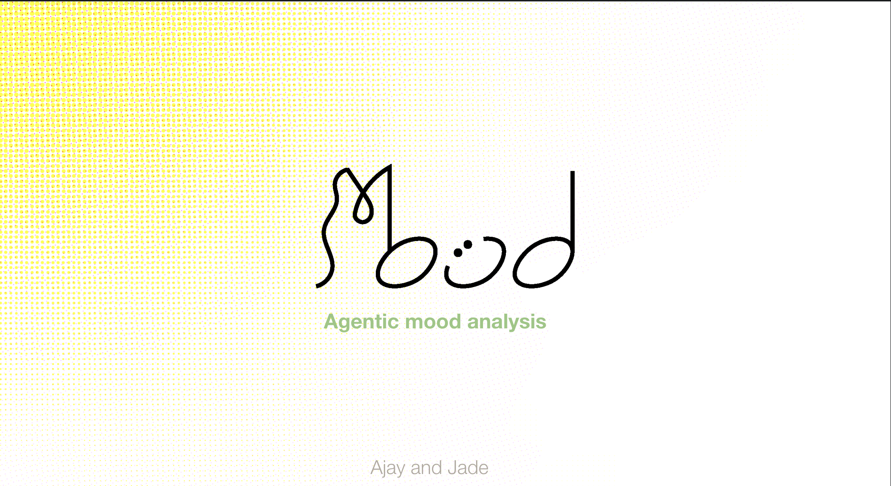
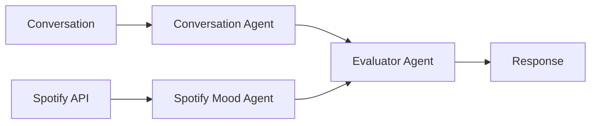

# `Mood` Agentic Mood Analysis



# Repo Installation

To install this repo, first clone it, then run:

```bash
uv pip install -r requirements.txt
```

# Setup

To run a copy of this server first install `ngrok`. 

```bash
brew install --cask ngrok
```

then spin up the `FastAPI` server

```bash
fastapi dev api.py
```

then run `ngrok` to expose the server to the internet

```bash
ngrok http 8000
```

# Usage

Once you've got the server running, you can call:

```bash
python3 src/agents.py
```

This will prompt you with a question. The agentic flow is as follows: 


